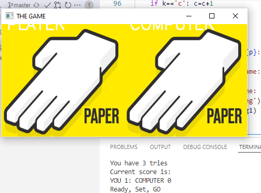
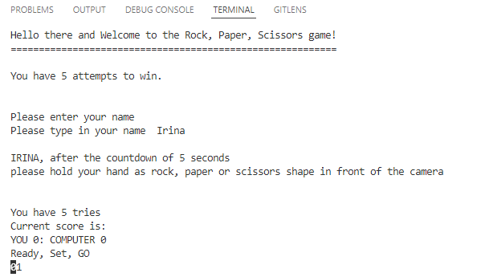

# Rock Paper Scissors Project
>Computer Vision Rock Paper Scissors is a project that uses Teachable Machine (google) to train the model to distinct between 4 states (hand gesture for rock, paper, scissors or none).

## Table of Contents
* [General Info](#general-information)
* [Technologies Used](#technologies-used)
* [Features](#features)
* [Screenshots](#screenshots)
* [Setup](#setup)
* [Usage](#usage)
* [Project Status](#project-status)
* [Room for Improvement](#room-for-improvement)
* [Acknowledgements](#acknowledgements)
* [Contact](#contact)

## General Information
The project has been undertaken as a part of the training course provided by AiCore.

The project  is using four functions as separate files
- "comp_choice" is the function that create a random choice of rock, paper or scissors.

- "player_choice" is the function that utilises the model, created in Milestone 1 step. The functon required the video input of the player captured by the build-in camera, that later is used to return the player choice. If the camera cannot recognise the choice, it asks the player to repeat the camera capturing process. 

- "countdown" is a small function developed to display 5 second countdown to the player prior to turning on the camera.

- "outcome" is the function that produces the game outcome based on the previous input, computer and player.

- "game" is the key file with the function main that is being played while the player is interested to continue.

The project uses visuals to display choices selected by player and computer.

## Technologies Used
    - Python 3.8
    - Teachable Machine (google) to recreate one's own model

## Features
- Trained model creates more visual and interactive yet otherwise simple game.
- Aditional result picture clearly shows the choice made by computer and if the player gesture had been properly decoded.

## Screenshots

## Setup
Project requires the following libraries
    - libraries: cv2, keras.models, numpy, pandas, time
Project requires one ph5 file that contains data on trained model, additional four .py files with functions, and three png file that later combined to show the outcome of the throw.
## Usage
- Example of the player_choice method used in the game:
`def player_choice():
    pred=[]
    model = load_model('RPS_model.h5', compile=False)
    cap = cv2.VideoCapture(0)
    data = np.ndarray(shape=(1, 224, 224, 3), dtype=np.float32)

    while True: 
        ret, frame = cap.read()
        ...
        cv2.imshow('frame', frame)
        pred.append(prediction)
        if cv2.waitKey(1) & 0xFF == ord('q'):
            break
    ...
    cv2.destroyAllWindows()
    pred=pd.DataFrame(np.concatenate(pred), columns=['NONE', 'ROCK', 'PAPER', 'SCISSORS'])
    df2 = pred[pred.columns[pred.mean(axis=0) == np.max(pred.mean(axis=0))]]
    [item]=sorted(df2)
    return(item)`

- countdown method:
'import time
def countdown(timer=5):
    print("Ready, Set, GO")
    for i in range(timer):
        print (f"0{timer-i}", end="\r")
        time.sleep(1)'

## Project Status
Project is: _complete_ .

## Room for Improvement
Model can be further used for training purposes or as a part of the game building process.
For more tuned model it will be benedificial to use large database of the images and perhaps involve other people, when training the model.

## Acknowledgements
- This project was inspired by AiCore

## Contact
Created by [@IrinaKW](irina.k.white@gmail.com) - feel free to contact me!

